---
## Front matter
title: "Лабораторная работа №4"
subtitle: "Продвинутое использование git"
author: "Приспешкин Андрей Андреевич"

## Generic otions
lang: ru-RU
toc-title: "Содержание"

## Bibliography
bibliography: bib/cite.bib
csl: pandoc/csl/gost-r-7-0-5-2008-numeric.csl

## Pdf output format
toc: true # Table of contents
toc-depth: 2
lof: true # List of figures
lot: true # List of tables
fontsize: 12pt
linestretch: 1.5
papersize: a4
documentclass: scrreprt
## I18n polyglossia
polyglossia-lang:
  name: russian
  options:
	- spelling=modern
	- babelshorthands=true
polyglossia-otherlangs:
  name: english
## I18n babel
babel-lang: russian
babel-otherlangs: english
## Fonts
mainfont: PT Serif
romanfont: PT Serif
sansfont: PT Sans
monofont: PT Mono
mainfontoptions: Ligatures=TeX
romanfontoptions: Ligatures=TeX
sansfontoptions: Ligatures=TeX,Scale=MatchLowercase
monofontoptions: Scale=MatchLowercase,Scale=0.9
## Biblatex
biblatex: true
biblio-style: "gost-numeric"
biblatexoptions:
  - parentracker=true
  - backend=biber
  - hyperref=auto
  - language=auto
  - autolang=other*
  - citestyle=gost-numeric
## Pandoc-crossref LaTeX customization
figureTitle: "Рис."
tableTitle: "Таблица"
listingTitle: "Листинг"
lofTitle: "Список иллюстраций"
lotTitle: "Список таблиц"
lolTitle: "Листинги"
## Misc options
indent: true
header-includes:
  - \usepackage{indentfirst}
  - \usepackage{float} # keep figures where there are in the text
  - \floatplacement{figure}{H} # keep figures where there are in the text
---

# Цель работы

Получение навыков правильной работы с репозиториями git.

# Задание

Выполнить работу для тестового репозитория.

Преобразовать рабочий репозиторий в репозиторий с git-flow и conventional commits.

# Выполнение лабораторной работы

Установим программное обеспечние gitflow node.js и pnpm(Рис.1, 2 и 3)

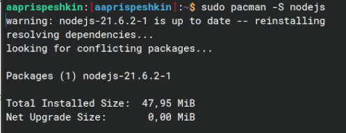

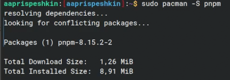

Добавим каталог с исполняемыми файлами через pnpm setup и выполним команду source в каталоге bashrc(Рис.4)

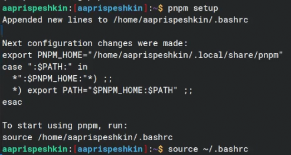

Установим программы commitizen и standard-changelog через pnpm(Рис.5 и 6)

Создадим новый репозиторий на Github и назовём его git-extended(Рис.7)

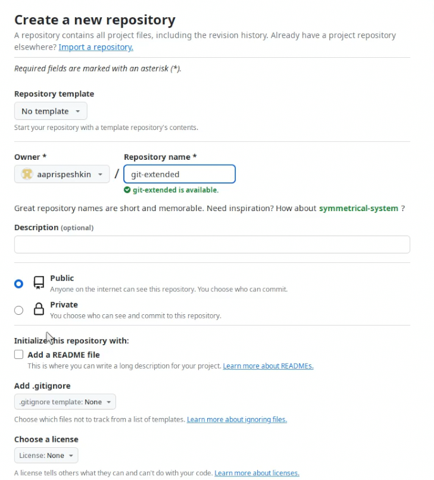

Сделаем первый коммит и выложим его на Github(Рис.8)

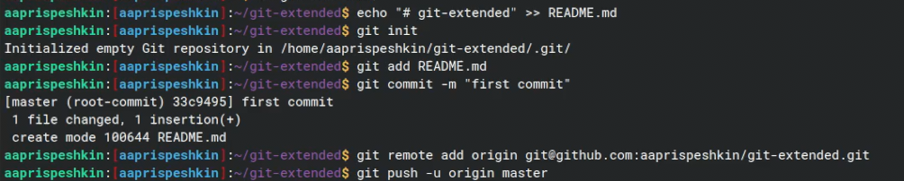

Сконфигурируем пакеты для Node.js через команду pnpm init(Рис.9)

Добавим в package.json команду для формирования коммитов(Рис.10)

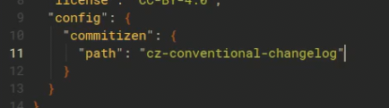

Выполним коммит командой git cz(Рис.11)

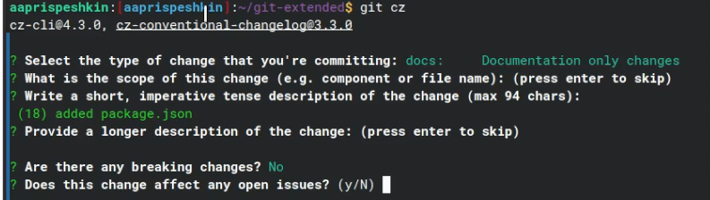

Начнём конфигурацию gitflow(Рис.12)

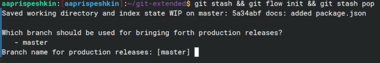

Через git branch проверим что мы находимся на ветке develop(Рис.13)

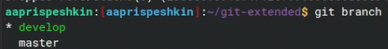

Установим внешнюю ветку как вышестоящую и создадим релиз с версией 1.0.0(Рис.14)

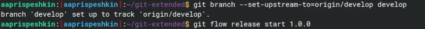

Создадим журнал изменений и добавим его в индекс(Рис.15)

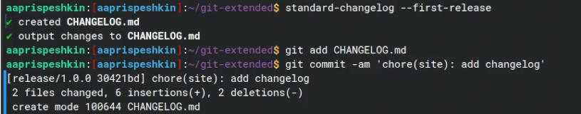

Зальём релизную ветку в основную ветку через git flow release finish и номер нашего релиза(Рис.16)

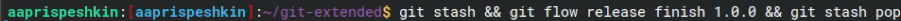

Создадим релиз на github утилитой gh(Рис.17)

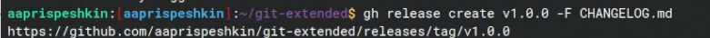

Создадим ветку для новой функциональности и объединим её с веткой develop(Рис.18)

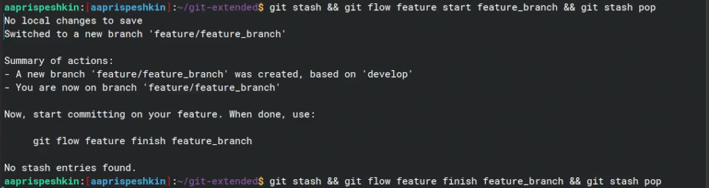

Создадим релиз с версией 1.2.3(Рис.19)

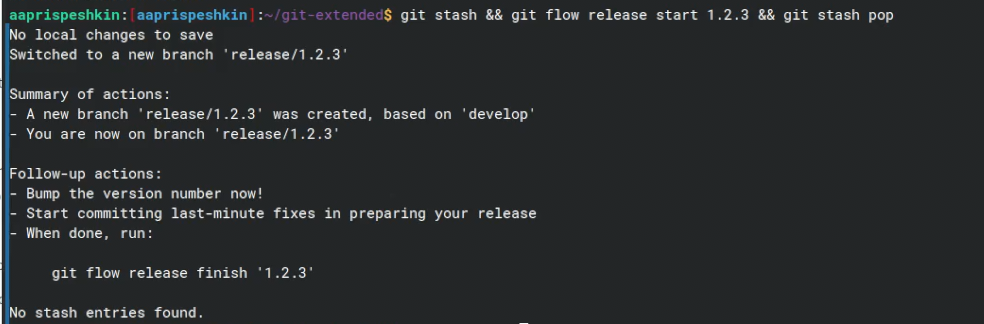

Обновим номер нашего релиза в package.json(Рис.20)

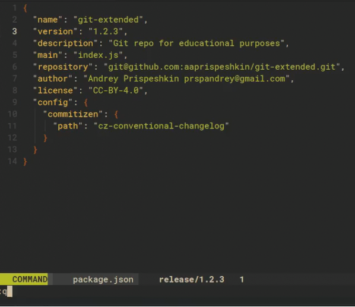

Создадим журнал изменений и внесём его в индекс(Рис.21)

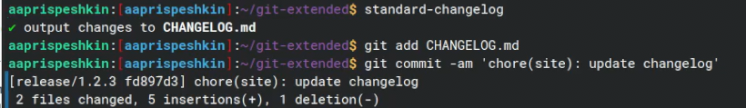

Зальём релизную ветку в основную ветку(Рис.22)

Создадим релиз на github с комментарием из журнала изменений(Рис.23)

# Выводы

Я получил навыки правильной работы с репозиториями git.

