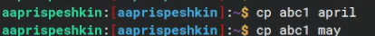
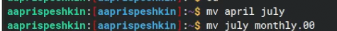
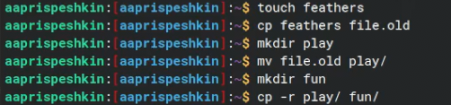

---
## Front matter
title: "Лабораторная работа №7"
subtitle: "Анализ файловой системы Linux. Команды для работы с файлами и каталогами"
author: "Приспешкин Андрей Андреевич"

## Generic otions
lang: ru-RU
toc-title: "Содержание"

## Bibliography
bibliography: bib/cite.bib
csl: pandoc/csl/gost-r-7-0-5-2008-numeric.csl

## Pdf output format
toc: true # Table of contents
toc-depth: 2
lof: true # List of figures
lot: true # List of tables
fontsize: 12pt
linestretch: 1.5
papersize: a4
documentclass: scrreprt
## I18n polyglossia
polyglossia-lang:
  name: russian
  options:
	- spelling=modern
	- babelshorthands=true
polyglossia-otherlangs:
  name: english
## I18n babel
babel-lang: russian
babel-otherlangs: english
## Fonts
mainfont: PT Serif
romanfont: PT Serif
sansfont: PT Sans
monofont: PT Mono
mainfontoptions: Ligatures=TeX
romanfontoptions: Ligatures=TeX
sansfontoptions: Ligatures=TeX,Scale=MatchLowercase
monofontoptions: Scale=MatchLowercase,Scale=0.9
## Biblatex
biblatex: true
biblio-style: "gost-numeric"
biblatexoptions:
  - parentracker=true
  - backend=biber
  - hyperref=auto
  - language=auto
  - autolang=other*
  - citestyle=gost-numeric
## Pandoc-crossref LaTeX customization
figureTitle: "Рис."
tableTitle: "Таблица"
listingTitle: "Листинг"
lofTitle: "Список иллюстраций"
lotTitle: "Список таблиц"
lolTitle: "Листинги"
## Misc options
indent: true
header-includes:
  - \usepackage{indentfirst}
  - \usepackage{float} # keep figures where there are in the text
  - \floatplacement{figure}{H} # keep figures where there are in the text
---

# Цель работы

Ознакомление с файловой системой Linux, её структурой, именами и содержанием
каталогов. Приобретение практических навыков по применению команд для работы
с файлами и каталогами, по управлению процессами (и работами), по проверке исполь-
зования диска и обслуживанию файловой системы.

# Задание

    Выполнить все примеры из лабораторной работы
    Выполнить команды по копированию, созданию и перемещению файлов и каталогов
    Определить опции команды chmod
    Изменить права доступа к файлам
    Прочитать документацию о командах mount, fsck, mkfs, kill

# Выполнение лабораторной работы

Создадим файл abc1 и скопируем из него два новых файла april и may(Рис.1)

Создадим каталог monthly и скопируем туда файлы april и may(Рис.2)

Переименум may в june(Рис.3)

Рекурсивно скопируем каталог monthly.00 в каталог /tmp(Рис.4)

Переименуем april в july и переместим july в каталоге monthly.00(Рис.5)

Создадим каталог reports и переместим туда каталог monthly.01, затем переименуем monthly.01 в monthly(Рис.6)

Создадим файл may, проверим его права доступа, и добавим право на выполнение(Рис.7)

Затем уберём у файла may право на выполнение(Рис.8)

Копируем файл io.h из каталога /usr/include/sys в домашний каталог и переименуем его в equipment, затем создадим каталог ski.plases и переместим туда скопированный нами файл(Рис.9)

Переместим файлы equiplist1 и equiplist2 в каталог ski.plases/equipment(Рис.10)

Создадим каталог newdir и переместим его в ski.plases дав ему название plans(Рис.11)

Утилитой cat выведем в командную строку содержимое файла /etc/passwd(Рис.12)

Создадим файл feathers, переименуем его с копированием в файл file.old, создадим каталог play и переместим туда file.old, затем создадим каталог fun и рекурсивно копируем в него каталог play(Рис.13)

Заберём у файла feathers право на чтение и попытаемся вывести на экран его содержимое, заметим что нам отказано в доступе. Затем попробуем скопировать файл feathers в feathers1, заметим что ошибка повторяется. Вернём файлу feathers право на чтение.

Заберём у каталога play право на выполнение и попробуем перейти в него, заметим что нам отказано в доступе(Рис.15)

Прочитай мануалы к командам mount, fsck и kill(Рис.16)

# Выводы

Я ознакомился с файловой системой Linux и приобрёл практические навыки по применению команд для работы с файлами и каталогами

